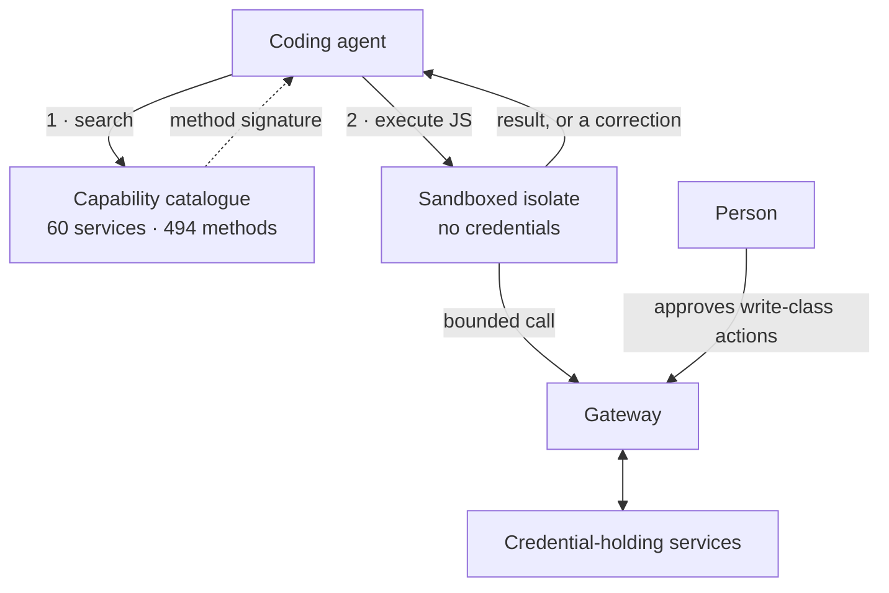

<!--
  ____                       _    _    ___
 |  _ \ __ _ ___  ___ __ _  | |  / \  |_ _|
 | |_) / _` / __|/ __/ _` | | | / _ \  | |
 |  __/ (_| \__ \ (_| (_| | | |/ ___ \ | |
 |_|   \__,_|___/\___\__,_| |_/_/   \_\___|

  Ingenious Digital · Fort Lauderdale · (954) 834-3426
  pascal@ingeniousdigital.com
-->

  <picture>
    <source media="(prefers-color-scheme: dark)" srcset="https://raw.githubusercontent.com/PascalAI2024/PascalAI2024/main/assets/header-dark-v4.svg">
    <source media="(prefers-color-scheme: light)" srcset="https://raw.githubusercontent.com/PascalAI2024/PascalAI2024/main/assets/header-light-v4.svg">
    
  </picture>

  

  <a href="https://ingeniousdigital.com"><b>Ingenious Digital</b></a> ·
  <a href="https://ingeniousdigital.com/services">Services</a> ·
  <a href="https://igddev.com">IGD Dev Lab</a> ·
  <a href="https://github.com/PascalAI2024/portfolio">Portfolio</a> ·
  <a href="mailto:pascal@ingeniousdigital.com"><b>pascal@ingeniousdigital.com</b></a>

---

I run **[Ingenious Digital](https://ingeniousdigital.com)**, a product studio in
Fort Lauderdale. Most weeks that means client websites, Shopify storefronts,
WordPress builds, SEO and lead funnels, CRM and automation work — the systems a
business actually runs on.

The rest of the time it's GPU kernels, Zig shells, ESP32 firmware and agent
infrastructure, which is where most of this GitHub comes from.

---

## Client work

Live sites, built and maintained by the shop.

| Site | What we built | Stack |
| :-- | :-- | :-- |
| **[Healthy Glow Aesthetics](https://healthyglowaesthetics.com)** | Med spa site and local SEO — ranks on "Fort Lauderdale med spa" search intent | WordPress · SEO |
| **[Healthy Glow Shop](https://shop.healthyglowaesthetics.com)** | Product storefront, custom theme and merchandising | Shopify |
| **[The Fort Lauderdale MedSpa](https://thefortlauderdalemedspa.com)** | Practice site for injectables and skincare, built around booking intent | WordPress · SEO |
| **[Ingenious Digital](https://ingeniousdigital.com)** | The studio's own site — React, TypeScript, 3D, voice assistant, CRM automation | React · TS |

Also: digital marketing, ad management, lead generation, GA4 and CRM wiring,
and post-launch maintenance. Service breakdown at
[ingeniousdigital.com/services](https://ingeniousdigital.com/services).

---

## Products

Built by the studio, live in production.

| | | |
| :-- | :-- | :-- |
| **[ButlerCRM](https://butlercrm.com)** | AI-first CRM for revenue teams | Elixir · Phoenix LiveView |
| **[GlowClient](https://glowclient.com)** | Practice management for medical aesthetics — booking, payments, clients | Full-stack TS |
| **[NexusDialer](https://nexusdialer.com)** | Enterprise contact center with BYOS | Full-stack TS |
| **[TraceKill](https://tracekill.com)** | Data-broker exposure scanning | Full-stack TS |
| **[PolyHuntr](https://polyhuntr.com)** | Copy trading, gated on the math | Full-stack TS |
| **[VibeGotchi](https://vibegotchi.pages.dev)** | GitHub-powered virtual pet, read-only OAuth | [open source](https://github.com/PascalAI2024/VibeGotchi) |

More out of [IGD Dev Lab](https://igddev.com): **Oxide Studio** (AI dev
environment driving 700+ models), **Juba** (investigative dossier builder with a
force-directed knowledge graph), **ZeroChat** (on-device voice agent),
**DataAlchemy**, **TariffSync**, **VocalFrame**, **ZeroInbox**, **CallCue**,
**HVAC Recruit**, **HerCircle**, and a real-time space strategy game with
deterministic combat and orbital mechanics.

---

## What we build

| Lane | What that means on a Tuesday |
| :-- | :-- |
| 🌐 **Web, commerce & content** | Marketing sites, Shopify themes, WordPress builds, SEO and lead-gen funnels |
| 📞 **CRM, comms & automation** | CRM platforms, contact-center systems, automation wired into the stack a client already has |
| 📈 **Growth** | Lead capture, SEO, ad management, conversion and reporting wired into GA4 and the CRM |
| 🤖 **AI agents & MCP infrastructure** | Supervised agent fleets, scoped MCP access, audited operations |
| 🔬 **ML & GPU research** | Leakage-safe datasets, CUDA kernel work, sub-2-bit quantization |
| ⚙️ **Native tools & systems** | A Zig shell workspace, a capability-safe agent language, self-hosted WireGuard |
| 🔌 **Embedded & hardware** | ESP32-S3 firmware, AMOLED and voice interfaces, guarded tool bridges |

---

## Stack

<table>
<tr><td><b>Client web & commerce</b></td><td>

</td></tr>
<tr><td><b>Backend & data</b></td><td>

</td></tr>
<tr><td><b>Systems & embedded</b></td><td>

</td></tr>
<tr><td><b>Apps, 3D & games</b></td><td>

</td></tr>
<tr><td><b>Infra & tooling</b></td><td>

</td></tr>
</table>

Plus Traefik, Dokploy, Proxmox, ESP-IDF, CUDA, WireGuard and GA4 — which don't
have icons but do have production hours.

---

## Open source

<table>
<tr>
<td width="50%" valign="top">

### 🧪 [fplbench](https://github.com/PascalAI2024/fplbench)

A leakage-safe Fantasy Premier League dataset and forecasting system. The
forecast is committed before the deadline, the model plays its own public team,
and automation grades the frozen forecast after the gameweek.

`Python` · [dataset](https://huggingface.co/datasets/x0me/fplbench) · [live board](https://huggingface.co/spaces/x0me/fplbench-board)

</td>
<td width="50%" valign="top">

### ⚡ [Maple CUDA](https://github.com/PascalAI2024/maple-preview-windows-cuda)

Seven local CUDA patches that made a 20B‑A1B ternary model practical on a 16 GB
GPU under Windows. Generation 52 → 377 tok/s, prompt processing 1,457 → 10,674
tok/s, against a 103-case CPU-reference matrix.

`CUDA` · [benchmarks](https://huggingface.co/datasets/x0me/maple-preview-cuda-benchmarks) · [case study](https://github.com/PascalAI2024/portfolio/blob/main/case-studies/maple-cuda.md)

</td>
</tr>
<tr>
<td width="50%" valign="top">

### 🐚 [ZiggyZag](https://github.com/PascalAI2024/ZiggyZag)

An all-Zig shell workspace: a readable shell core, native Windows and macOS
terminal hosts, a cross-platform launcher, and a local AI sidecar. The agent
proposes mutations; the host owns the approval.

`Zig` · [releases](https://github.com/PascalAI2024/ZiggyZag/releases)

</td>
<td width="50%" valign="top">

### 🤖 [JarvisNano](https://github.com/PascalAI2024/JarvisNano)

ESP32-S3 firmware for a pocket desktop assistant: round AMOLED display, touch,
microphone and speaker paths, live voice, device diagnostics, and a guarded tool
bridge.

`C` · `ESP-IDF` · [architecture](https://github.com/PascalAI2024/JarvisNano/blob/main/docs/ARCHITECTURE.md)

</td>
</tr>
</table>

  <picture>
    <source media="(prefers-color-scheme: dark)" srcset="https://raw.githubusercontent.com/PascalAI2024/PascalAI2024/main/assets/bench-dark.svg">
    <source media="(prefers-color-scheme: light)" srcset="https://raw.githubusercontent.com/PascalAI2024/PascalAI2024/main/assets/bench-light.svg">
    
  </picture>

| Project | Lane | Status |
| :-- | :-- | :-- |
| [fplbench](https://github.com/PascalAI2024/fplbench) | Applied ML / data | Live 2026/27 benchmark |
| [Maple CUDA](https://github.com/PascalAI2024/maple-preview-windows-cuda) | GPU performance | v1.0 release + post-release MMQ research |
| [Qwen Quant Bench](https://github.com/PascalAI2024/qwen38-27b-quant-bench) | LLM research | Completed research record |
| [ZiggyZag](https://github.com/PascalAI2024/ZiggyZag) | Native dev tools | Active alpha |
| [JarvisNano](https://github.com/PascalAI2024/JarvisNano) | Embedded AI | Hardware release candidate |
| [PicoArmy](https://github.com/PascalAI2024/picoarmy) | Agent fleets | Public prototype, no deployment |
| [Verrow](https://github.com/PascalAI2024/verrow) | Data operations | Public prototype |
| [KinTunnel](https://github.com/PascalAI2024/kintunnel) | Self-hosted networking | Runnable MVP, dry-run default |
| [PAL](https://github.com/PascalAI2024/pal-lang) | Language research | Early concept |

[Case studies](https://github.com/PascalAI2024/portfolio/blob/main/case-studies/README.md) ·
[capability map](https://github.com/PascalAI2024/portfolio/blob/main/capabilities/README.md) ·
[system shapes](https://github.com/PascalAI2024/portfolio/blob/main/architecture/README.md) ·
[evidence ledger](https://github.com/PascalAI2024/portfolio/blob/main/proof/README.md)

---

## In-house

The studio runs on tooling built for itself. Source-private, so what follows is
the shape and the scale — not the machinery.

### JarvisMCP — one gateway, two tools

Most agent setups bolt on an MCP server per integration and drown the model in
tool definitions before it does any work. This inverts it. The agent gets **two**
tools — search and execute — writes JavaScript against them, and the catalogue
stays server-side.

<table>
<tr>
<td align="center"><b>2</b> tools exposed</td>
<td align="center"><b>60</b> services</td>
<td align="center"><b>494</b> discoverable methods</td>
<td align="center"><b>~500</b> tokens per session</td>
<td align="center"><b>1,100+</b> tests</td>
</tr>
</table>

Capability lookup happens before execution. Agent-authored code runs in a
sandboxed isolate holding no credentials, and the services that do hold them sit
outside that boundary. Failed calls come back with a correction rather than a
stack trace, and long-running work survives restarts on a coordination board
with leases and checkpoints.

### Overwatch — search intelligence as one working surface

Rank tracking, search performance, local visibility and AI-era search signals in
a single self-hosted project view, instead of five specialist dashboards.
Background jobs keep the picture current; the assistant proposes actions and a
human approves them. `Bun` · `TanStack Start` · `PostgreSQL` · `Drizzle`

### ButlerCRM — follow-up that doesn't get dropped

AI-first CRM for revenue teams, running live at
[butlercrm.com](https://butlercrm.com). `Elixir` · `Phoenix LiveView` ·
`PostgreSQL`

### GigaBrain — operating memory you can point an agent at

A knowledge-vault template that ships with structure and **no data** — nothing
project-, client- or person-specific. Point an agent at a copy and it learns the
project's architecture, positioning and history as you fill it in, then keeps it
maintained.

### Sandbox fleet

Self-hosted disposable environments so agents can run real work — installs,
builds, migrations — without touching anything that matters.

> Client data, credentials, production topology, security controls, internal
> prompts, service addresses and access paths stay out of public repositories.
> The [boundaries](https://github.com/PascalAI2024/portfolio/blob/main/PUBLIC_BOUNDARIES.md)
> are written down, so the line doesn't get decided case by case.

---

## Also true

- Half my infrastructure is named after a fictional butler.
- A Shopify theme, a Roblox scene and a CUDA kernel can land in the same week of commits.
- The stack runs from `Shopify Liquid` to `ESP-IDF`. Nobody planned that.
- `~/dev` holds about ninety projects. These are the ones that made it out.

---

## Work together

Websites and storefronts that have to convert. CRMs and automations that have to
hold up. Or the harder end — AI and agent infrastructure, performance work,
research systems, and prototypes that have to become maintainable products.

  <a href="mailto:pascal@ingeniousdigital.com"><b>pascal@ingeniousdigital.com</b></a> ·
  <a href="https://ingeniousdigital.com/contact"><b>ingeniousdigital.com/contact</b></a> ·
  (954) 834-3426 
  Fort Lauderdale, on Eastern time · shipping worldwide

  
    <a href="https://ingeniousdigital.com">ingeniousdigital.com</a> ·
    <a href="https://igddev.com">igddev.com</a> ·
    <a href="https://huggingface.co/x0me">huggingface.co/x0me</a> ·
    <a href="https://github.com/PascalAI2024/portfolio">portfolio</a>
  

<!--
  You went looking in the source. Respect.
  pascal@ingeniousdigital.com — mention the ASCII art.
-->
