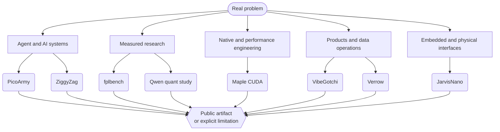

<!--
  ____                       _    _    ___
 |  _ \ __ _ ___  ___ __ _  | |  / \  |_ _|
 | |_) / _` / __|/ __/ _` | | | / _ \  | |
 |  __/ (_| \__ \ (_| (_| | | |/ ___ \ | |
 |_|   \__,_|___/\___\__,_| |_/_/   \_\___|

  You read the source instead of the summary. That is the whole method.
  Everything below this line is claimed with a link you can open and check.
  Nothing here is measured in adjectives.
                                  Ingenious Digital · ingeniousdigital.com
-->

  <picture>
    <source media="(prefers-color-scheme: dark)" srcset="https://raw.githubusercontent.com/PascalAI2024/PascalAI2024/main/assets/header-dark.svg">
    <source media="(prefers-color-scheme: light)" srcset="https://raw.githubusercontent.com/PascalAI2024/PascalAI2024/main/assets/header-light.svg">
    
  </picture>

  

  <a href="https://github.com/PascalAI2024/portfolio"><b>Portfolio</b></a> ·
  <a href="https://github.com/PascalAI2024/portfolio/blob/main/case-studies/README.md">Case studies</a> ·
  <a href="https://github.com/PascalAI2024/portfolio/blob/main/proof/README.md">Evidence ledger</a> ·
  <a href="https://huggingface.co/x0me">Hugging Face</a> ·
  <a href="https://igddev.com">IGD/dev</a> ·
  <a href="https://ingeniousdigital.com/contact"><b>Work together</b></a>

---

## The short version

I build across an unusual but coherent range — governed agent infrastructure,
applied machine learning, GPU performance engineering, native developer tools,
web products, data operations, and embedded AI.

The common thread is not a framework. It is an operating discipline:

> Turn an ambiguous problem into a legible product or experiment · keep human
> authority visible wherever software can cause real effects · measure the
> result against a fair baseline · publish the evidence, the limitations, and
> the current status together.

Building at **[Ingenious Digital](https://ingeniousdigital.com)**. Everything
below is public and inspectable.

---

## Proof, not adjectives

Every number here has a repository, a dataset, or a live surface behind it.

| Result | What it actually means | Open it |
| :-- | :-- | :-- |
| **52 → 377 tok/s** | Generation speedup on a 20B‑A1B ternary MoE, from local CUDA patches | [Maple CUDA](https://github.com/PascalAI2024/maple-preview-windows-cuda) |
| **1,457 → 10,674 tok/s** | Prompt processing, measured in a fresh A/B/B/A run — not one lucky pass | [benchmark data](https://huggingface.co/datasets/x0me/maple-preview-cuda-benchmarks) |
| **103 / 103** | Every enabled build passed the full CPU‑reference correctness matrix. Speed without a correctness gate is not a result | [method](https://github.com/PascalAI2024/portfolio/blob/main/case-studies/maple-cuda.md) |
| **7.3 GB VRAM** | A 20B model made practical on a 16 GB consumer card instead of datacenter hardware | [repo](https://github.com/PascalAI2024/maple-preview-windows-cuda) |
| **Frozen forecasts** | Predictions committed *before* each deadline, then graded against official actuals by automation | [fplbench board](https://huggingface.co/spaces/x0me/fplbench-board) |
| **Corrections trail** | A public log of what I got wrong, kept next to what I got right | [evidence ledger](https://github.com/PascalAI2024/portfolio/blob/main/proof/README.md) |

---

## Flagships

<table>
<tr>
<td width="50%" valign="top">

### 🧪 [fplbench](https://github.com/PascalAI2024/fplbench)

**Applied ML that keeps score.**

A leakage-safe Fantasy Premier League dataset and forecasting system. The
forecast is committed before the deadline, the model plays its own public team,
and automation grades the frozen forecast after the gameweek. Source,
validation artifacts, a Hugging Face dataset, a living board, and an explicit
corrections trail.

`Python` · [dataset](https://huggingface.co/datasets/x0me/fplbench) · [live board](https://huggingface.co/spaces/x0me/fplbench-board) · [case study](https://github.com/PascalAI2024/portfolio/blob/main/case-studies/fplbench.md)

</td>
<td width="50%" valign="top">

### ⚡ [Maple CUDA](https://github.com/PascalAI2024/maple-preview-windows-cuda)

**Performance with correctness gates.**

Seven local CUDA patches made a 20B‑A1B ternary model practical on a 16 GB GPU
under Windows. The work records the failed paths as well as the winning ones:
generation 52 → 377 tok/s, prompt processing 1,457 → 10,674 tok/s, and a
103-case CPU-reference matrix every enabled build had to pass.

`CUDA` · `PowerShell` · [benchmarks](https://huggingface.co/datasets/x0me/maple-preview-cuda-benchmarks) · [case study](https://github.com/PascalAI2024/portfolio/blob/main/case-studies/maple-cuda.md)

</td>
</tr>
<tr>
<td width="50%" valign="top">

### 🐚 [ZiggyZag](https://github.com/PascalAI2024/ZiggyZag)

**Native software with an approval boundary.**

An all-Zig shell workspace: a readable shell core, native Windows and macOS
terminal hosts, a cross-platform launcher, and a local AI sidecar. The agent
proposes mutations; the host owns the approval. Process boundaries, release
artifacts, platform caveats, and conformance tests are exposed rather than
hidden behind a product screenshot.

`Zig` · [releases](https://github.com/PascalAI2024/ZiggyZag/releases) · [case study](https://github.com/PascalAI2024/portfolio/blob/main/case-studies/ziggyzag.md)

</td>
<td width="50%" valign="top">

### 🤖 [JarvisNano](https://github.com/PascalAI2024/JarvisNano)

**Where AI becomes a physical interaction problem.**

ESP32-S3 firmware for a pocket desktop assistant: round AMOLED display, touch,
microphone and speaker paths, live voice, device diagnostics, and a guarded
tool bridge. The active v1 target is real hardware on a desk; unfinished tracks
stay labeled as unfinished.

`C` · `ESP-IDF` · [architecture](https://github.com/PascalAI2024/JarvisNano/blob/main/docs/ARCHITECTURE.md) · [case study](https://github.com/PascalAI2024/portfolio/blob/main/case-studies/jarvisnano.md)

</td>
</tr>
</table>

---

## The range

### More public work

- **[VibeGotchi](https://github.com/PascalAI2024/VibeGotchi)** — a [live](https://vibegotchi.pages.dev) GitHub-powered virtual pet that evolves with your commit activity. Read-only OAuth, transparent scoring, shareable artifacts.
- **[PicoArmy](https://github.com/PascalAI2024/picoarmy)** — a TypeScript/PostgreSQL command center for supervised self-hosted agent fleets, with scoped MCP access and audited operations. No public deployment is claimed.
- **[Qwen quant benchmark](https://github.com/PascalAI2024/qwen38-27b-quant-bench)** — sub-2-bit quantization and speculative-decoding research on a 16 GB card, published with raw results, limitations, and a corrections log.
- **[Verrow](https://github.com/PascalAI2024/verrow)** — an open lead-data quality workbench. Ingestion and mapping are implemented; later data surfaces are labeled prototype.
- **[gods-eye-view](https://github.com/PascalAI2024/gods-eye-view)** — a spy-satellite simulator in the browser, except the spatial data is real.
- **[PAL](https://github.com/PascalAI2024/pal-lang)** — a durable, capability-safe language design for supervised AI agents.

---

## How this work is judged

The same four rules apply to everything above — including the parts that
disappoint.

1. **The artifact must be inspectable.** Source, a live surface, raw evidence, or a clearly bounded public-safe narrative.
2. **The comparison must be fair.** Frozen forecasts, controlled A/B runs, common masks, correctness references, disclosed constraints.
3. **The human boundary must be legible.** Approval, privacy, credentials, and irreversible actions are product decisions — not footnotes.
4. **Current status travels with the claim.** Alpha is called alpha. A prototype is not quietly promoted to production by adjective.

Source-private work appears only as clearly labeled context. It is never counted
as public proof because a description sounds plausible.

---

## Work together

The best fit is work that needs both product judgment and engineering depth:
applied AI, agent infrastructure, custom software, performance work, research
systems, and complex prototypes that need to become maintainable products.

  <a href="https://ingeniousdigital.com/contact"><b>Start a conversation with Ingenious Digital →</b></a>

  
    <a href="https://ingeniousdigital.com">ingeniousdigital.com</a> ·
    <a href="https://igddev.com">igddev.com</a> ·
    <a href="https://huggingface.co/x0me">huggingface.co/x0me</a> ·
    <a href="https://github.com/PascalAI2024/portfolio">the full record</a>
  

<!--
  Still reading the source? Then you already pass rule 1.
  The evidence ledger is the least flattering and most useful page here:
  https://github.com/PascalAI2024/portfolio/blob/main/proof/README.md
-->
