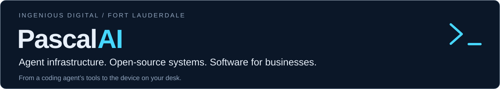

  <picture>
    <source media="(prefers-color-scheme: dark)" srcset="assets/header-dark-v5.svg">
    <source media="(prefers-color-scheme: light)" srcset="assets/header-light-v5.svg">
    
  </picture>

  <a href="https://github.com/PascalAI2024/portfolio"><b>Selected work</b></a> ·
  <a href="https://ingeniousdigital.com">Ingenious Digital</a> ·
  <a href="https://igddev.com">Dev Lab</a> ·
  <a href="mailto:pascal@ingeniousdigital.com">Get in touch</a>

I’m Pascal. I run **[Ingenious Digital](https://ingeniousdigital.com)** in Fort Lauderdale,
building custom software, websites, commerce, and automation for businesses.
My engineering work spans agent infrastructure, applied ML, GPU performance,
native developer tools, and embedded AI.

The common thread: make complex systems useful, keep their boundaries explicit,
and leave evidence someone else can inspect.

## Flagship · JarvisMCP

**The coordination and execution backbone for my AI-assisted studio. Closed-source.**

Jarvis gives coding agents two tools — **search** and **execute** — to discover
capabilities and compose work in JavaScript. The catalogue stays server-side,
so integrations can grow without loading every method into the agent’s context.

The more interesting part is what happens between sessions: a shared work board,
explicit ownership, leases, checkpoints, and evidence let work continue across
agents and computers. The task’s state lives beyond the conversation that started it.

| Design choice | Why it matters |
| :-- | :-- |
| Discover first, then execute | A small interface to a broad operations surface |
| Sandboxed execution | Agent-authored code stays separate from credential-holding services |
| Durable coordination | Work can be claimed, resumed, and closed against recorded evidence |

Built for the studio’s own operations. The
**[public architecture story](https://github.com/PascalAI2024/portfolio/blob/main/case-studies/jarvismcp.md)**
describes the design; the source and operational details remain private.

## Selected open source

Four projects you can inspect, build on, and follow in public.

### [JarvisNano](https://github.com/PascalAI2024/JarvisNano) · Embedded AI

A voice-first desk companion for the **Waveshare ESP32-S3 Touch AMOLED 1.75C**.
Firmware brings together a round display, touch, live voice, device state, and
a policy-gated tool bridge. A physical interface to assistant work, with
hardware release-candidate QA still in progress.

`C` · `ESP-IDF` · `Apache-2.0` · [Architecture](https://github.com/PascalAI2024/JarvisNano/blob/main/docs/ARCHITECTURE.md)

JarvisNano is the public firmware project; JarvisMCP is the separate, private gateway.

### [Maple CUDA](https://github.com/PascalAI2024/maple-preview-windows-cuda) · GPU performance

Windows setup scripts and CUDA patches for the **20B-A1B ternary Maple-Preview model**.
The work repairs an unreachable generation path and accelerates prompt processing,
with CPU-reference correctness checks and published benchmark artifacts.
The original RTX 4080 SUPER generation experiment recorded **52 → 377 tokens/s**;
the linked evidence separates later configurations and prompt-processing results.

`CUDA` · `PowerShell` · `MIT` · [Benchmarks](https://huggingface.co/datasets/x0me/maple-preview-cuda-benchmarks) · [Case study](https://github.com/PascalAI2024/portfolio/blob/main/case-studies/maple-cuda.md)

### [fplbench](https://github.com/PascalAI2024/fplbench) · Applied ML

Fantasy Premier League data and reproducible forecasts with a public scoring record.
Predictions are frozen before the deadline and graded after verified gameweeks.
The project makes data leakage, forecast provenance, and evaluation part of the
engineering contract.

`Python` · `LightGBM` · `MIT code` · [Dataset](https://huggingface.co/datasets/x0me/fplbench) · [Live board](https://huggingface.co/spaces/x0me/fplbench-board)

The code license is separate from the underlying football data’s usage terms.

### [ZiggyZag](https://github.com/PascalAI2024/ZiggyZag) · Native developer tools

An alpha shell workspace written in Zig: a readable shell core, native Windows
and macOS terminal hosts, and a local AI sidecar. The sidecar proposes actions;
the host owns approval. Linux currently has the shell and launcher.

`Zig` · `MIT` · [Releases](https://github.com/PascalAI2024/ZiggyZag/releases)

**[More case studies](https://github.com/PascalAI2024/portfolio/blob/main/case-studies/README.md)** ·
[Evidence ledger](https://github.com/PascalAI2024/portfolio/blob/main/proof/README.md)

## Studio systems & client work

The same engineering goes into business software and the work around it.

| Selected work | Focus |
| :-- | :-- |
| **[ButlerCRM](https://butlercrm.com)** | CRM for revenue teams, built with Elixir and Phoenix LiveView. Closed-source. |
| **[Overwatch](https://github.com/PascalAI2024/portfolio/blob/main/case-studies/overwatch.md)** | Search and analytics signals in a shared project workspace, with AI-assisted work under human review. Closed-source. |
| **[Healthy Glow Aesthetics](https://healthyglowaesthetics.com)** | WordPress, local SEO, and a booking-focused practice website |
| **[Healthy Glow Shop](https://shop.healthyglowaesthetics.com)** | Shopify storefront, custom theme, and merchandising |
| **[The Fort Lauderdale MedSpa](https://thefortlauderdalemedspa.com)** | WordPress practice website built around treatment discovery and booking |

Broader studio work includes CRM integrations, lead capture, GA4 reporting,
automation, and ongoing site maintenance. Explore the
[services](https://ingeniousdigital.com/services) or [Dev Lab](https://igddev.com).

## Tools I work with

**Products & data:** TypeScript, React, Elixir/Phoenix, Python, PostgreSQL. 
**Systems & hardware:** Zig, C/C++, CUDA, ESP-IDF. 
**Client delivery & operations:** WordPress, Shopify, Docker, Linux, Cloudflare.

## Work together

Custom software, commerce, and automation — or a difficult systems problem that
needs a working product and a clear handoff.

**[pascal@ingeniousdigital.com](mailto:pascal@ingeniousdigital.com)** ·
[Contact the studio](https://ingeniousdigital.com/contact) 
Fort Lauderdale · Eastern time · Working worldwide
