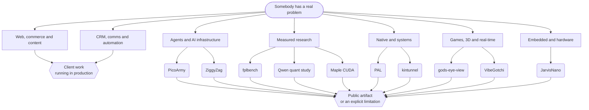

<!--
  ____                       _    _    ___
 |  _ \ __ _ ___  ___ __ _  | |  / \  |_ _|
 | |_) / _` / __|/ __/ _` | | | / _ \  | |
 |  __/ (_| \__ \ (_| (_| | | |/ ___ \ | |
 |_|   \__,_|___/\___\__,_| |_/_/   \_\___|

  You read the source instead of the summary. Good instinct — that's the
  whole method around here. Every claim below this line has a link you can
  open and check. Nothing is measured in adjectives.

  Ingenious Digital · Fort Lauderdale · (954) 834-3426
-->

  <picture>
    <source media="(prefers-color-scheme: dark)" srcset="https://raw.githubusercontent.com/PascalAI2024/PascalAI2024/main/assets/header-dark.svg">
    <source media="(prefers-color-scheme: light)" srcset="https://raw.githubusercontent.com/PascalAI2024/PascalAI2024/main/assets/header-light.svg">
    
  </picture>

  

  <a href="https://ingeniousdigital.com"><b>Ingenious Digital</b></a> ·
  <a href="https://igddev.com">IGD Dev Lab</a> ·
  <a href="https://github.com/PascalAI2024/portfolio">Portfolio</a> ·
  <a href="https://github.com/PascalAI2024/portfolio/blob/main/proof/README.md">Evidence ledger</a> ·
  <a href="https://huggingface.co/x0me">Hugging Face</a> ·
  <a href="https://ingeniousdigital.com/contact"><b>Hire the shop</b></a>

---

## Hey — I'm Pascal 👋

I run **[Ingenious Digital](https://ingeniousdigital.com)**, a product studio in
Fort Lauderdale. By day that means fractional CTO work, custom software,
automations, and the websites and CRMs that keep South Florida businesses
running. By night it means GPU kernels, Zig shells, ESP32 firmware, agent
fleets, and games — because the interesting problems don't respect job titles.

It looks like a wildly scattered range. It's actually one habit applied to all
of it:

> Turn a fuzzy problem into a thing you can point at · keep the human in charge
> wherever software can do real damage · measure it against a fair baseline ·
> then publish the evidence, the limits, and the current status **together**.

Alpha is called alpha here. That's the whole trick.

---

## What we actually build

| Lane | What that means on a Tuesday | Where to look |
| :-- | :-- | :-- |
| 🌐 **Web, commerce & content** | Marketing sites, Shopify themes, WordPress builds, SEO and lead-gen funnels for businesses with actual revenue on the line | [ingeniousdigital.com](https://ingeniousdigital.com) |
| 📞 **CRM, comms & automation** | ButlerCRM, NexusDialer, communication systems, business automation wired into the stack a client already has | [services](https://ingeniousdigital.com/services) |
| 🤖 **AI agents & MCP infrastructure** | Supervised agent fleets, scoped MCP access, audited operations — the agent proposes, a human still approves | [PicoArmy](https://github.com/PascalAI2024/picoarmy) |
| 🔬 **ML & GPU research** | Leakage-safe datasets, CUDA kernel work, sub-2-bit quantization studies — published with the raw numbers and the failures | [Hugging Face](https://huggingface.co/x0me) |
| ⚙️ **Native tools & systems** | A Zig shell workspace, a capability-safe agent language, self-hosted WireGuard access | [ZiggyZag](https://github.com/PascalAI2024/ZiggyZag) · [PAL](https://github.com/PascalAI2024/pal-lang) · [kintunnel](https://github.com/PascalAI2024/kintunnel) |
| 🎮 **Games, 3D & real-time** | Browser 3D, real-time sims, and a satellite view of the planet that runs on real spatial data | [gods-eye-view](https://github.com/PascalAI2024/gods-eye-view) · [IGD Dev Lab](https://igddev.com) |
| 🔌 **Embedded & hardware** | ESP32-S3 firmware, AMOLED + voice interfaces, guarded tool bridges on a chip the size of a stamp | [JarvisNano](https://github.com/PascalAI2024/JarvisNano) |

---

## The receipts

Anyone can write "high performance." Here's the version with links attached.

| Result | What it actually means | Open it |
| :-- | :-- | :-- |
| **52 → 377 tok/s** | Generation speedup on a 20B‑A1B ternary MoE, from local CUDA patches | [Maple CUDA](https://github.com/PascalAI2024/maple-preview-windows-cuda) |
| **1,457 → 10,674 tok/s** | Prompt processing, measured in a fresh A/B/B/A run — not one lucky pass | [benchmark data](https://huggingface.co/datasets/x0me/maple-preview-cuda-benchmarks) |
| **103 / 103** | Every enabled build passed the full CPU‑reference correctness matrix. Speed without a correctness gate isn't a result | [method](https://github.com/PascalAI2024/portfolio/blob/main/case-studies/maple-cuda.md) |
| **7.3 GB VRAM** | A 20B model made practical on a 16 GB consumer card instead of datacenter hardware | [repo](https://github.com/PascalAI2024/maple-preview-windows-cuda) |
| **Frozen forecasts** | Predictions committed *before* each deadline, then graded against official actuals by automation | [fplbench board](https://huggingface.co/spaces/x0me/fplbench-board) |
| **A corrections log** | A public record of what I got wrong, filed next to what I got right | [evidence ledger](https://github.com/PascalAI2024/portfolio/blob/main/proof/README.md) |

---

## Flagships

<table>
<tr>
<td width="50%" valign="top">

### 🧪 [fplbench](https://github.com/PascalAI2024/fplbench)

**Applied ML that keeps score.**

A leakage-safe Fantasy Premier League dataset and forecasting system. The
forecast is committed before the deadline, the model plays its own public team,
and automation grades the frozen forecast after the gameweek. Source, validation
artifacts, a Hugging Face dataset, a living board, and an explicit corrections
trail. It is very hard to fool a benchmark that grades you in public.

`Python` · [dataset](https://huggingface.co/datasets/x0me/fplbench) · [live board](https://huggingface.co/spaces/x0me/fplbench-board) · [case study](https://github.com/PascalAI2024/portfolio/blob/main/case-studies/fplbench.md)

</td>
<td width="50%" valign="top">

### ⚡ [Maple CUDA](https://github.com/PascalAI2024/maple-preview-windows-cuda)

**Performance with correctness gates.**

Seven local CUDA patches made a 20B‑A1B ternary model practical on a 16 GB GPU
under Windows. The repo records the dead ends as well as the wins: generation
52 → 377 tok/s, prompt processing 1,457 → 10,674 tok/s, and a 103-case
CPU-reference matrix every enabled build had to clear before it counted.

`CUDA` · `PowerShell` · [benchmarks](https://huggingface.co/datasets/x0me/maple-preview-cuda-benchmarks) · [case study](https://github.com/PascalAI2024/portfolio/blob/main/case-studies/maple-cuda.md)

</td>
</tr>
<tr>
<td width="50%" valign="top">

### 🐚 [ZiggyZag](https://github.com/PascalAI2024/ZiggyZag)

**Native software with an approval boundary.**

An all-Zig shell workspace: a readable shell core, native Windows and macOS
terminal hosts, a cross-platform launcher, and a local AI sidecar. The agent
proposes mutations; the host owns the approval. Process boundaries, release
artifacts, platform caveats, and conformance tests are all exposed rather than
hidden behind a pretty screenshot.

`Zig` · [releases](https://github.com/PascalAI2024/ZiggyZag/releases) · [case study](https://github.com/PascalAI2024/portfolio/blob/main/case-studies/ziggyzag.md)

</td>
<td width="50%" valign="top">

### 🤖 [JarvisNano](https://github.com/PascalAI2024/JarvisNano)

**Where AI stops being a chat box.**

ESP32-S3 firmware for a pocket desktop assistant: round AMOLED display, touch,
microphone and speaker paths, live voice, device diagnostics, and a guarded tool
bridge. The v1 target is real hardware sitting on a real desk — and the
unfinished tracks stay labeled unfinished.

`C` · `ESP-IDF` · [architecture](https://github.com/PascalAI2024/JarvisNano/blob/main/docs/ARCHITECTURE.md) · [case study](https://github.com/PascalAI2024/portfolio/blob/main/case-studies/jarvisnano.md)

</td>
</tr>
</table>

---

## The range, as a picture

### More public work

- **[VibeGotchi](https://github.com/PascalAI2024/VibeGotchi)** — a [live](https://vibegotchi.pages.dev) GitHub-powered virtual pet that evolves with your commit activity. Read-only OAuth, transparent scoring, shareable artifacts. Yes, it judges your streak.
- **[gods-eye-view](https://github.com/PascalAI2024/gods-eye-view)** — a spy-satellite simulator in the browser, except the spatial data is real.
- **[PicoArmy](https://github.com/PascalAI2024/picoarmy)** — a TypeScript/PostgreSQL command center for supervised self-hosted agent fleets, with scoped MCP access and audited operations. No public deployment is claimed.
- **[Verrow](https://github.com/PascalAI2024/verrow)** — an open lead-data quality workbench. Ingestion and mapping are implemented; the later data surfaces are labeled prototype, because they are.
- **[Qwen quant benchmark](https://github.com/PascalAI2024/qwen38-27b-quant-bench)** — sub-2-bit quantization and speculative-decoding research on a 16 GB card, published with raw results, limitations, and a corrections log.
- **[PAL](https://github.com/PascalAI2024/pal-lang)** · **[kintunnel](https://github.com/PascalAI2024/kintunnel)** — a capability-safe language for supervised agents, and self-hosted WireGuard access for people you trust.

A pile of the production work — ButlerCRM, TraceKill, Overwatch, NexusDialer,
client storefronts — is source-private and appears here only as labeled context.
Private work never gets counted as public proof just because the description
sounds good.

---

## How I judge my own work

1. **The artifact must be inspectable.** Source, a live surface, raw evidence, or a clearly bounded public-safe write-up.
2. **The comparison must be fair.** Frozen forecasts, controlled A/B runs, common masks, correctness references, disclosed constraints.
3. **The human boundary must be legible.** Approval, privacy, credentials, and irreversible actions are product decisions — not footnotes.
4. **Status travels with the claim.** A prototype does not get promoted to production by adjective.

---

## Also true

- Half my infrastructure is named after a fictional butler. I have made peace with this.
- A Zig shell, a Roblox scene, and a CUDA kernel can land in the same week of commits. This is a feature.
- I keep a public corrections log, which is the least flattering and most useful page I maintain.
- The stack ranges from `Shopify Liquid` to `ESP-IDF`. Nobody planned that. It just kept being the right tool.

---

## Work together

The best fit is work that needs product judgment *and* engineering depth: AI and
automation, agent infrastructure, custom software, performance work, research
systems, and ambitious prototypes that have to become maintainable products.

Or, honestly — a website and a CRM that finally talk to each other. That counts too.

  <a href="https://ingeniousdigital.com/contact"><b>Start a conversation with Ingenious Digital →</b></a> 
  Fort Lauderdale, on Eastern time · shipping worldwide

  
    <a href="https://ingeniousdigital.com">ingeniousdigital.com</a> ·
    <a href="https://igddev.com">igddev.com</a> ·
    <a href="https://huggingface.co/x0me">huggingface.co/x0me</a> ·
    <a href="https://github.com/PascalAI2024/portfolio">the full record</a>
  

<!--
  Still reading the source? Then you already pass rule 1.
  The evidence ledger is where the honest version lives:
  https://github.com/PascalAI2024/portfolio/blob/main/proof/README.md
-->
