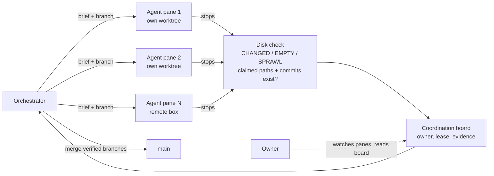

# Agent cockpit: parallel coding agents, checked against the disk

**Publication status:** draft 
**Project status:** in daily use by the studio; private tooling 
**Domains:** agent orchestration, developer tooling, Git workflow 
**Evidence reviewed:** 2026-09-27 
**Public proof:** none. The source lives in a private configuration repository. This page describes the system shape only.

## The brief

Run several AI coding agents at once, on real repositories, without losing
track of what each one is doing, and without taking any of them at their word.

One agent in one terminal is easy to supervise. Ten are not. They finish at
different times, some stall on a prompt nobody can see, and "done" in an agent's
final message tells you nothing about whether a file changed.

## The constraints

- **Agents come from different vendors.** Each CLI has its own startup screens,
  approval prompts and failure modes. The cockpit can't assume one agent's behaviour.
- **They share repositories.** Two agents in one working tree share one Git
  index. A plain `git commit` from one can ship the other's staged files.
- **Idle isn't done.** A terminal multiplexer can report an agent as `working`,
  `blocked`, `done` or `idle`. Those are scheduler states. None of them says
  whether the agent produced anything.
- **The owner is watching.** The work has to be visible and steerable while it
  runs, not a batch job that reports back hours later.
- **It runs on a Windows workstation plus a remote Linux box**, and has to
  behave on both.

## The decisive move

Treat the filesystem as the only source of truth for "done".

When an agent stops, the cockpit reads its working tree and its branch. It
records `CHANGED`, `EMPTY` or `SPRAWL` (edits outside the agent's assigned
scope). A stop hook checks every path and commit hash the agent claims in its
final report. A claim it can't find on disk becomes a problem on the board, not
a line in a summary. An agent that ends its turn saying it is "waiting for" or
"polling" something is flagged as stopped mid-task: once it stops, nothing is
polling.

Everything else follows from that rule:

- **One branch and one worktree per agent**, so agents never share an index.
  Only the orchestrator merges, and a landed-branch check (Git patch IDs, so
  cherry-picks count) stops anyone rebasing work that main already has.
- **One visible pane per agent**, on top of an existing open-source terminal
  multiplexer, so the owner can read and interrupt any of them.
- **A durable coordination board** holds each work item's owner, lease,
  checkpoints and evidence. It outlives a crashed session or a restarted machine.
- **A written charter** that every agent receives: the report format, the
  scope rules, and what counts as a deliverable.

## The system shape

Left out on purpose: the model-routing rules, credential handling, the remote
host's address and access path, and the prompts themselves.

## The evidence

From one working day (2026-09-25), recorded in the cockpit's own retrospective:

- About 30 named agents across the workstation and the remote box. A live status
  read at one point showed 34 agents, 12 of them working.
- 23 friction points logged as numbered rows during the day. 16 were fixed the
  same day; three were still open at the end of it.
- The deliverable check's first live run flagged two agents that had stopped
  mid-task. It correctly passed a third, whose last line was a real hand-off to
  the owner.
- The landed-branch check found six worktree branches already fully merged and
  ready to remove.
- Test suites for the dispatch and board code: 143 of 143 and 48 of 49 passing
  (1 skipped: it needs a live gateway). Each new check was mutation-tested: we
  disabled the rule and confirmed its test failed.

## The learning

- **The expensive failures were quiet ones.** An agent stuck on a startup screen
  or a board that stopped updating did more damage than any crash, because nothing
  announced it. Most of the fixes that mattered were detectors: a heartbeat
  that reports board silence after 20 minutes, a check for each startup dialog
  that swallowed a prompt.
- **An idle notification can arrive before the agent's report is read.** Acting
  on "idle" alone meant the same brief ran twice. The rule now: read the
  messages and the tree before re-dispatching.
- **Concurrency needs a per-provider cap.** Opening about 30 sessions at once
  on one subscription got it rate-locked. A cap added that evening allows four
  live agents per subscription by default.
- Not yet proven: behaviour well past about 30 agents in a day, and anything
  beyond one workstation and one remote box.

## The boundary

The cockpit's source, its prompts, the coordination service behind the board,
model and vendor routing, and the infrastructure it runs on are private. No
client work, client names or client repositories appear here. The numbers above
come from the studio's internal records for one day and are not an independent benchmark.
